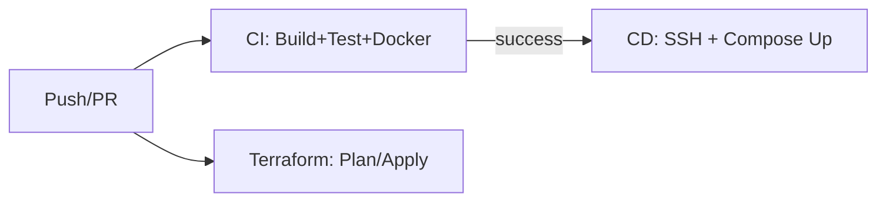

# Terraform + CI/CD — Apresentação Curta

## Visão Geral
- **Objetivo**: Provisionar infraestrutura mínima e automatizar qualidade, build e deploy do app.
- **Componentes**: Terraform (infra) + GitHub Actions (CI, validações, CD).

## Terraform — o que provisiona
- 1 **EC2 Ubuntu 22.04** com IP público, pronta para Docker/Compose.
- **Bootstrap** via user_data: instala Docker e plugin Compose; prepara `/opt/subscription-manager`.
- **Rede**: VPC/sub-rede públicas default.
- **Acesso/Segurança**: reutiliza **Key Pair** e **Security Group** existentes (por nome).
- **Saídas**: `instance_public_ip` e comando SSH.

## CI — Build, Testes e Imagem Docker
- Disparo: push/PR em `develop`/`main`.
- Sobe **Postgres** e **Redis** no runner.
- Executa: `npm ci`, Prisma generate/migrate, `lint`, `tests` e `coverage`.
- Build do app e artefato `dist/`.
- Build Docker multi‑arch (tags: branch/PR/semver, `latest` no default) e push (exceto PR).
- Validação do **Docker Compose** quando arquivos Docker mudam: valida sintaxe, builda, sobe serviços, health check `/api/health`, checa Postgres/Redis, derruba tudo.

## PR Checks — Qualidade e Feedback no PR
- `format`, `lint`, `tsc --noEmit` e `test:cov`.
- Comentário automático de cobertura no PR.

## CD — Deploy Automatizado
- Após CI bem‑sucedido (push em `main`/`develop`).
- Copia `docker-compose.yml` e `init.sql` para o servidor via SCP.
- No servidor: `docker pull` da imagem tagueada pela branch e `docker compose up -d`.
- Health check com retries em `/api/health`; em falha, exibe logs.

## Fluxo Simplificado

## Pré‑requisitos e Observações
- Conta AWS com **VPC default**, **Key Pair** e **Security Group** existentes (nomes esperados).
- Segredos no repositório: Docker Hub, AWS, SSH.
- Observação: em Compose Validation há `needs: docker` que pode ser removido/ajustado.
